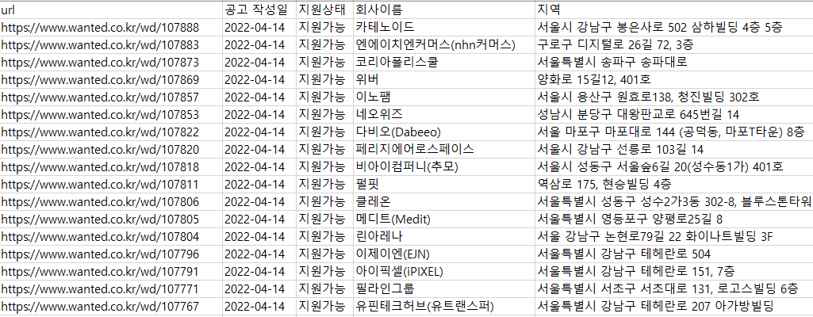

WANTED_TREND
===
***

## 📸 Screenshot

웹 크롤링 데이터를 엑셀형태로 저장합니다.
## 🔗 Link
- **프로젝트를 활용한 사이트 :** http://wantedtrend.site &ensp; 

* * *
# Introduce Project
* * *
이 프로젝트는 1인 프로젝트 입니다.

- 채용 플랫폼 [Wanted](https://wanted.co.kr/) 의 공고들을 통해 대한민국 기업들이 원하는 프로그래밍 언어 추세를 크롤링 했습니다.
- 크롤링한 데이터를 분석하여 작성일, 회사이름, 지역, 주요업무, 자격요건, 우대사항, 프로그래밍 언어 등을 분류했습니다.
- Json file을 만들어 크롤링에 사용되는 옵션들을 관리했습니다
- 최신 공고로부터 n개의 IT 공고를 크롤링 할 수 있습니다.
- 이전 크롤링 이후 ~ 최신공고 범위의 크롤링을 할 수 있습니다.
